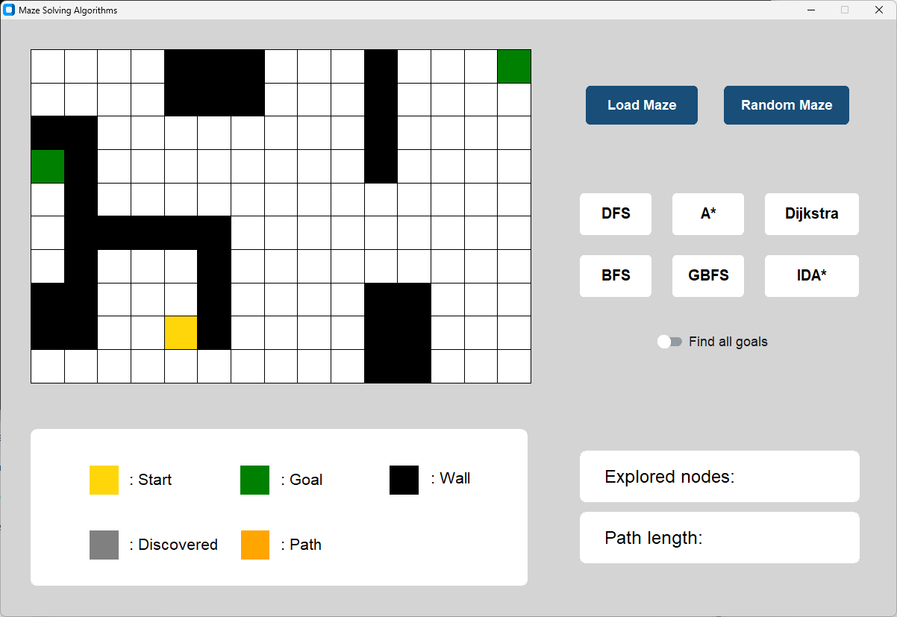
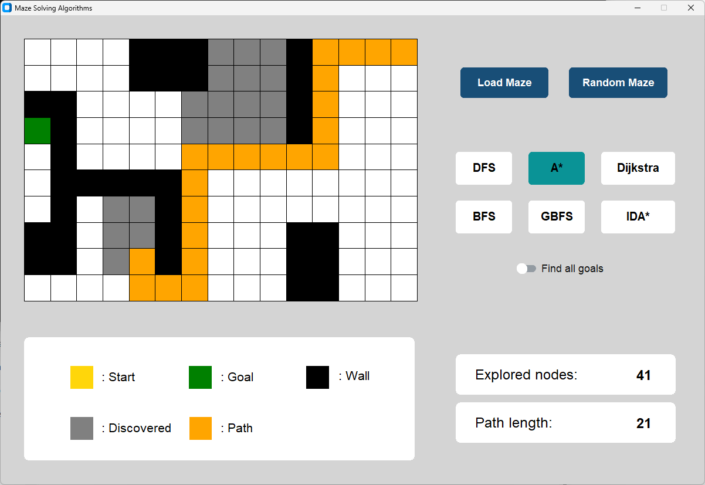
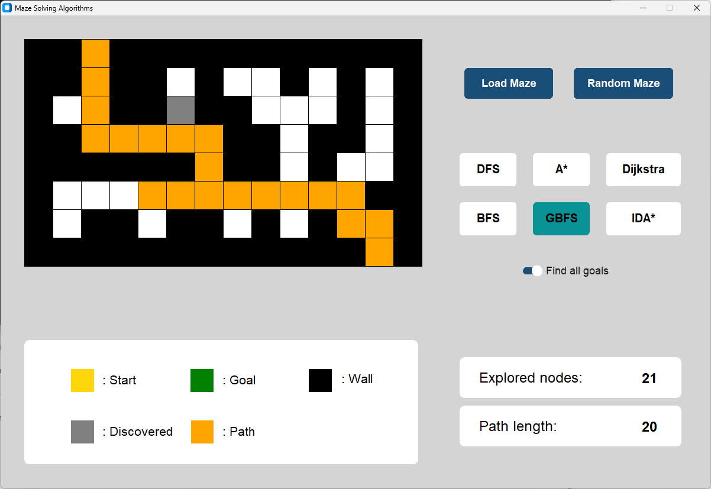
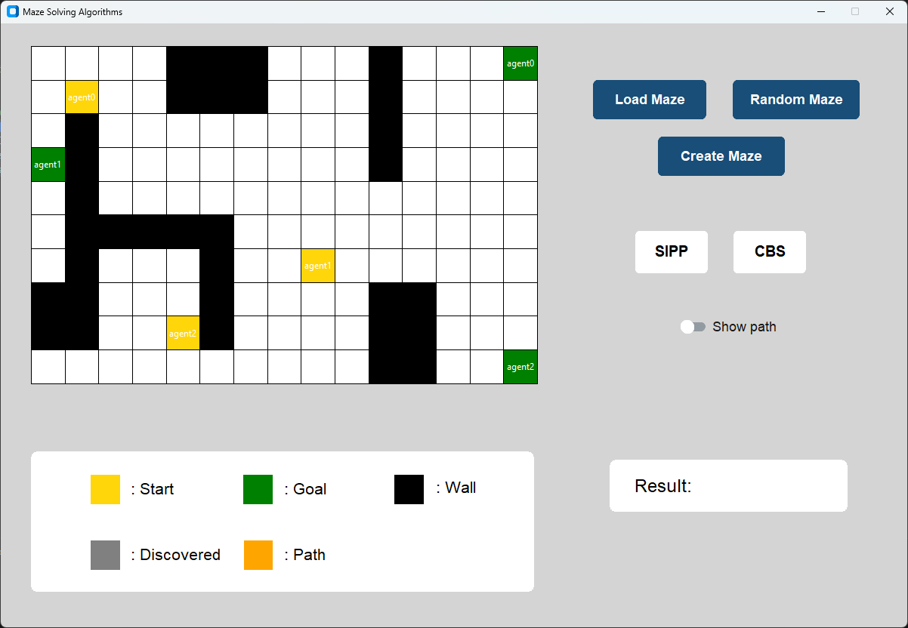
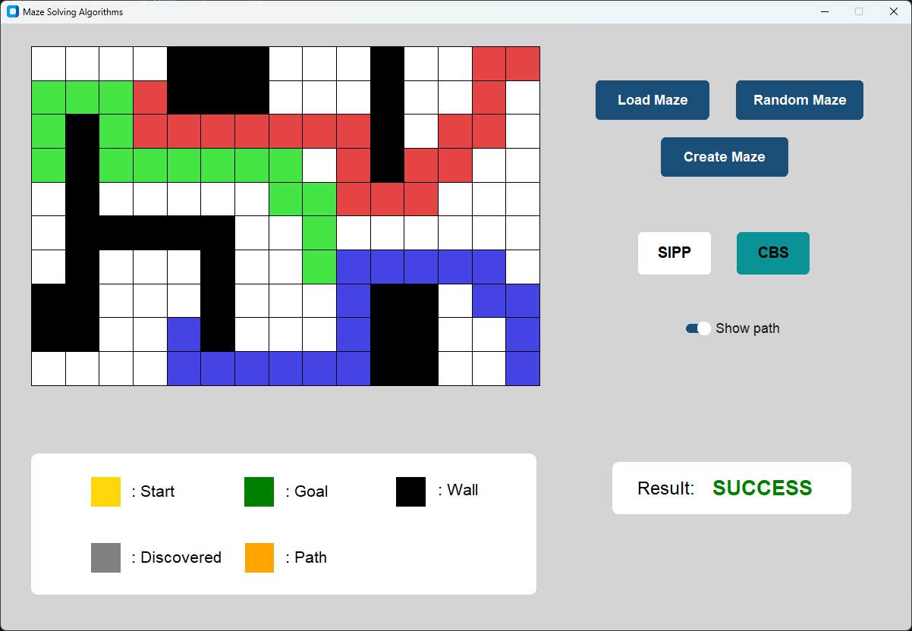
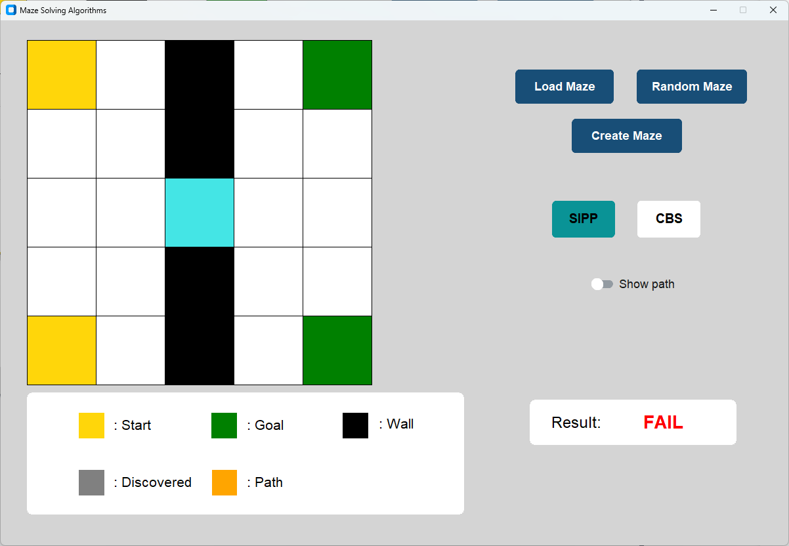
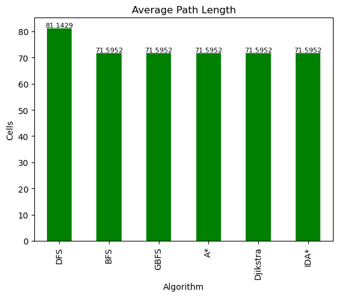
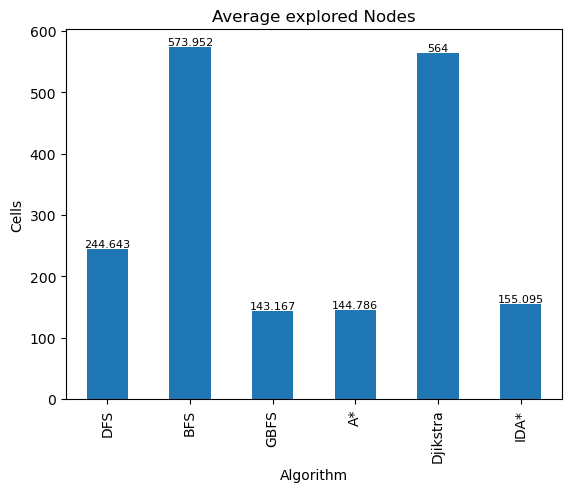
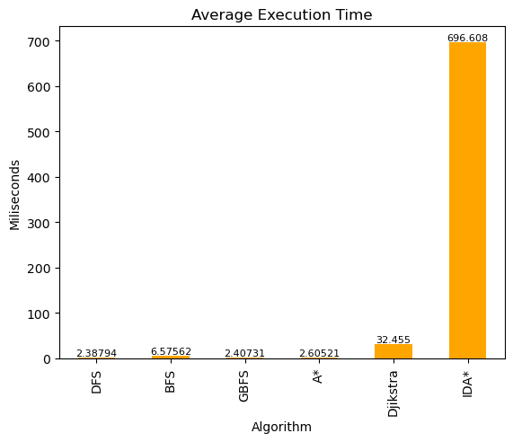

# Single and Multi-Agent Search Algorithms
This repository implements several search algorithms for both single-agent and multi-agent pathfinding in grid-based environments. The algorithms are designed to solve pathfinding problems efficiently in a static environment.

## Features
1. **Single-agent search algorithms:**
   - Depth-First Search (DFS)
   - Breadth-First Search (BFS)
   - Dijkstra's Algorithm
   - Greedy Best-First Search (GBFS)
   - A* Search
   - Iterative Deepening A* (IDA*)

2. **Multi-agent search algorithms:**
   - Safe-Interval Path Planning (SIPP)
   - Conflict-Based Search (CBS)

3. **Maze generation and manipulation:**
   - Load Maze: Load a maze from a text file
   - Random Maze: Generate a random maze
   - Create Maze: Build a custom maze using a GUI

## Instructions
### Single-Agent GUI
- **Start**: Select a search algorithm (DFS, BFS, Dijkstra, etc.) from the panel on the right.

  
- **Visualize**: Once an algorithm is selected, the maze will be displayed. Explored cells will appear in grey, and the final path will be highlighted in orange after the goal is reached. The number of cells explored and the path length will be displayed at the bottom-right.

  
- **Options**:
  - **Find All Goals**: Toggle this option to find the path that visits all goals.

  

### Multi-Agent GUI

- **Start**: Select one of the multi-agent algorithms (SIPP or CBS) from the right panel.

  
- **Agent Movement**: Different coloured agents will move from their start cells to goal cells without colliding.

  
- **Results**: The screen will display "SUCCESS" if all agents reach their goals, or "FAIL" if a collision occurs.

 
- **Show Paths**: Enable this option to visualize the paths taken by each agent.

## Acknowledgements
This project was developed as part of the AI for Games course and was inspired by implementations from various open-source projects.

# Single Agent Search Algorithms' Performance Evaluation
## Experimental Setup
In this study, my aim was to evaluate the performance of various search algorithms on 100 different mazes, generated using _Randomized Prim's Algorithm_. Each maze had a random width and height ranging from 30 to 60 cells, a start cell, and 1 to 3 randomly placed goal cells. The performance of the algorithms was assessed based on three metrics: **path length**, **explored cells**, and **execution time**.

## Results
### Path Length
\
The experiment results indicate that DFS algorithm had the longest average path length among the six algorithms tested, with an average of 81.14 cells. This is likely due to the nature of DFS, which explores a single path as far as possible before backtracking and exploring another path. This means that DFS is susceptible to getting trapped in local minimums and taking longer paths as it doesn't take into account the distance from the starting point to the current node. On the other hand, the other algorithms (BFS, GBFS, A*, Dijkstra, IDA*) use heuristics and/or distance calculations to determine the optimal path, resulting in shorter average path lengths of 71.6 cells. Although GBFS does not always guarantee the shortest path, for my generated maze, GBFS shows similar performance with other informed searches. Therefore, the results suggest that these algorithms are more effective than DFS for solving mazes with respect to finding the shortest path.

### Explored Cells
\
The results suggest that DFS and BFS algorithms expand a significantly larger number of cells as compared to informed search algorithms such as GBFS, A*, and IDA*. This is because DFS and BFS are blind search algorithms that explore the search tree exhaustively without using any heuristic information, resulting in a large number of expanded cells. In contrast, informed search algorithms such as GBFS, A*, and IDA* use heuristic information to guide the search towards the goal, which helps in reducing the number of explored cells. Dijkstra's algorithm, on the other hand, is not an informed search algorithm, but rather a weighted graph search algorithm that explores the graph in a breadth-first manner. Although it guarantees to find the optimal path, it explores all nodes uniformly, including those that are not promising, leading to a higher number of expanded cells than the informed algorithms that use heuristics.

### Execution Time
\
DFS, GBFS, and A* algorithms have relatively similar execution times, while BFS has a slightly longer execution time. Dijkstra's algorithm has a significantly higher execution time than the other algorithms, while IDA* has the highest execution time among all the algorithms tested. The higher execution time for Dijkstra's algorithm may be attributed to its need to explore all the nodes uniformly to guarantee finding the optimal solution. On the other hand, the higher execution time for IDA* may be due to the fact that it uses iterative deepening, which repeatedly applies the depth-first search until the solution is found, leading to a higher number of iterations and a longer execution time. Overall, the results suggest that informed search algorithms such as GBFS and A* are more efficient in terms of execution time compared to blind search algorithms such as DFS and BFS, while Dijkstra and IDA* may be more suitable for specific applications that require finding the optimal solution.
